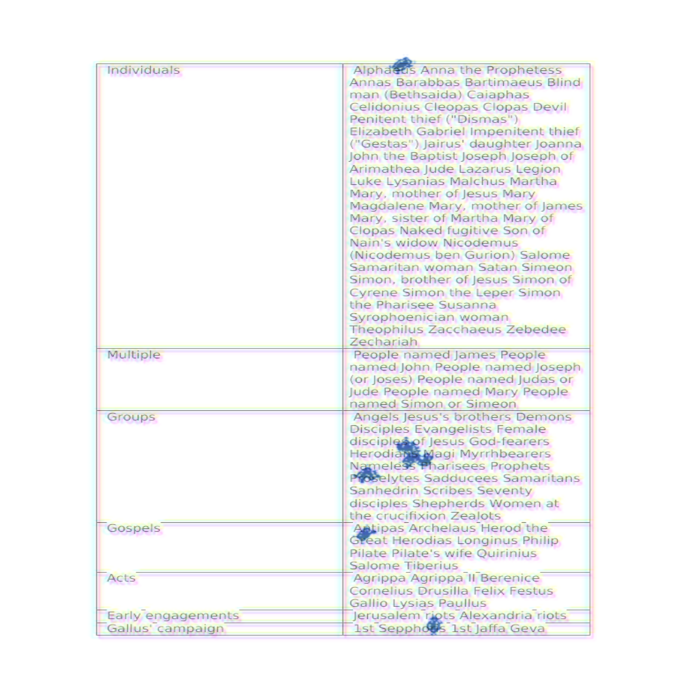
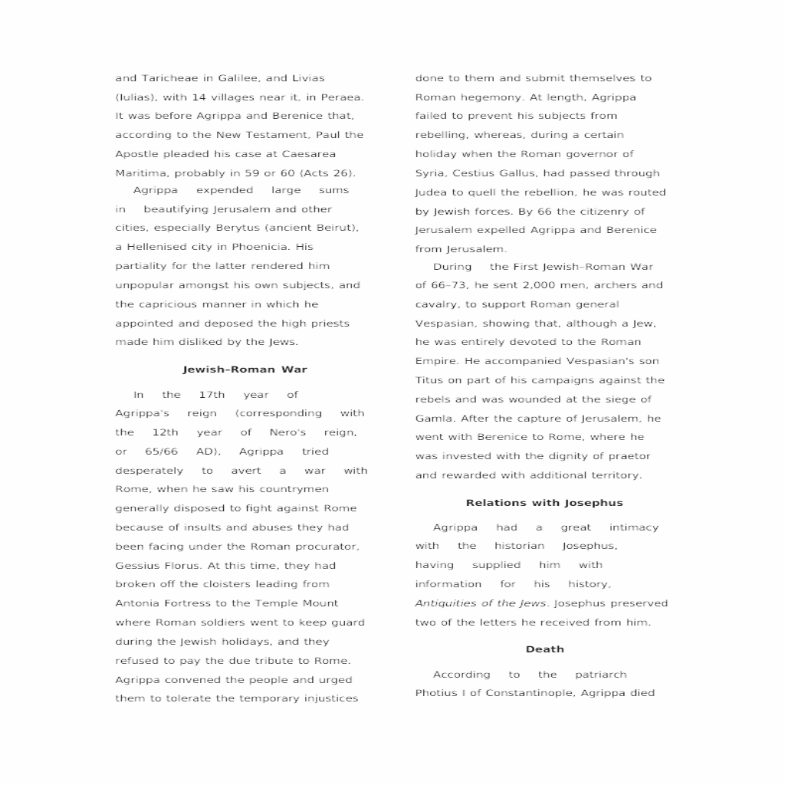
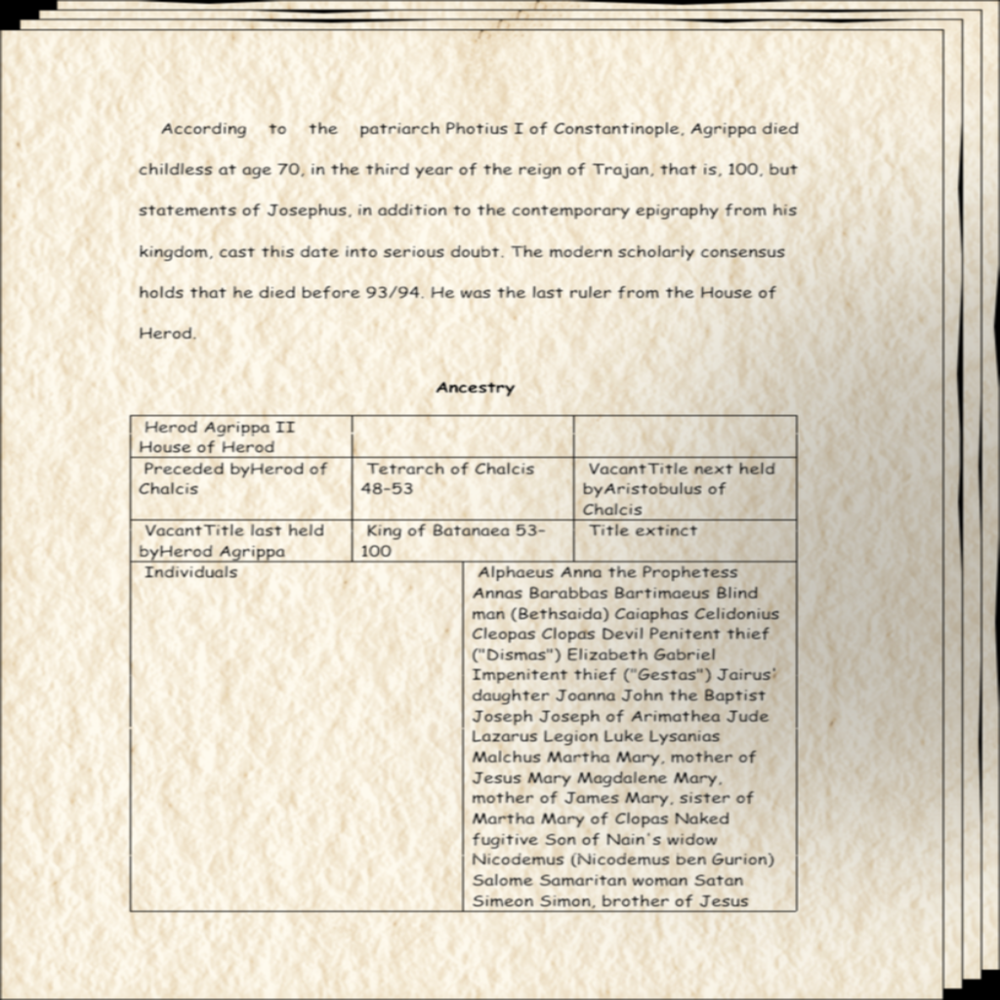
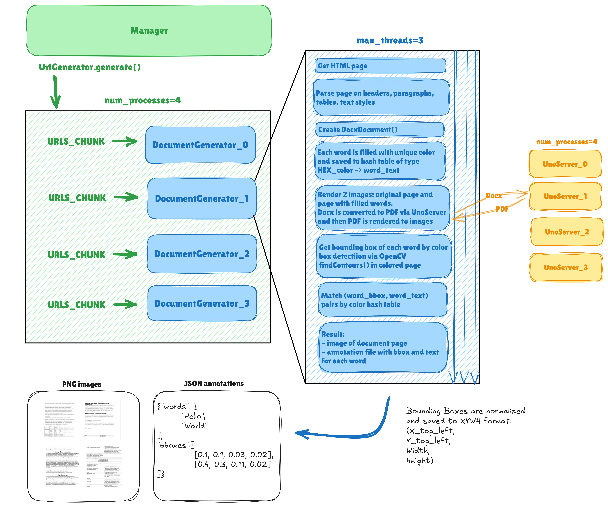

# DoGe — Synthetic DOcument GEnerator for Document AI

DoGe is designed to synthesize a dataset of realistic document scans. Each document contains meaningful text, headings, 
tables, pargraphs with different formatting and fonts which is parsed from Wikipedia. The coordinates 
of the words are extracted using the No-OCR method we invented for faster generation on CPU.

## Image examples






Check the full size (1024x1024) in [resources](./resources) folder.

## Usage

### Docker

You can use Docker image with predefined environment to run DoGe:
```bash
git clone https://github.com/Travvy88/DoGe
cd DoGe
docker build -t doge . && docker run -it doge
```

## Ubuntu

For faster generation, it is recommended to install all dependencies without Docker. 
Doge is tested on Ubuntu 22.04.
```bash
sudo apt-get update && apt-get install libreoffice libjpeg-dev zlib1g-dev poppler-utils
/usr/bin/python3 -m pip install --user unoserver  # install unoserver to system python

git clone https://github.com/Travvy88/DoGe
cd DoGe
pip3 install -r requirements.txt  # there you can make venv if needed!
```

## Start Data Generation

```bash
python3 main.py --out_dir data --image_size 244 --max_urls 16 --num_processes 2 --ports 4000 4001 4002 4003 --languages en ru
```

### Main.py

The following arguments can be passed to the script:

- `--out_dir`: The output directory for saving results. This argument is required.
- `--remove_excisting_dir`: If set to `True`, the output directory will be deleted before creating a new one. Default is `False`.
- `--image_size`: The size of the final images. Default is `244`.
- `--start_page`: The starting page URL. Default is the Wikipedia main page.
- `--languages`: The list of languages to consider. Default is `['en']`.
- `--max_urls`: The maximum number of URLs to process. Default is `100`.
- `--num_processes`: The number of processes to use. Default is `1`. Each process will start DocumentGenerator inside and start separate Unoserver.
- `--max_threads`: The maximum threads inside a process. Default is `3`.
- `--ports`: The list of ports to use. Default is `[8145, 8146]`. The number of ports should be 2 times larger than `num_processes`.


### Docx_config.json

| Parameter | Description |
|-------------|-------------|
| `max_words` | The maximum number of words allowed in the generated documents. |
| `p_2columns` | The probability that the document will be formatted into two columns. |
| `font_size_interval` | The font size range from which the size is randomly selected for each document. |
| `p_line_spacing` | A list of probabilities controlling the line spacing of the document (1.5 or double). |
| `p_text_alignment` | A list of probabilities controlling the text alignment of the document (center, left, right, justify). |
| `p_heading_bold` | The probability that headings will be displayed in bold font. |
| `heading_relative_size_interval` | The range of relative font sizes for headings. The relative font size is chosen randomly. |
| `p_heading_alignment` | A list of probabilities controlling the alignment of headings (center, left, right, justify). |
| `table_max_rows` | The maximum number of rows allowed in a table. Tables with more than the specified number of rows are dropped. |
| `table_max_cols` | The maximum number of columns allowed in a table. Tables with more than the specified number of columns are dropped. |

Parameters with probabilities and intervals calculate its values for each document randomly.

According to my experience, generator produces an average about 14 images for each url
with the above Docx settings. 

### Augmentations 

Augmentation pipeline applies on a final stage. You can manage different augmentations 
in `src/augmentations.py` file. Read the [Augraphy Docs](https://augraphy.readthedocs.io/en/latest/) for detailed explanation. 

### Urls Parsing

`src/UrlGenerator.py` generates a list of URLs by crawling the web, starting from a given start page, 
and following links on each page. It uses `BeautifulSoup` to parse HTML content and extracts links, 
then checks each link's validity, language and adds it to the list if it meets certain conditions. 
The process continues until a maximum number of URLs is reached, and the method returns the list of 
generated URLs, excluding the starting URL.


## How it works


Firstly, the `Manager` class creates the `DocumentGenerator` instances in separate processes. For 
each `DocumentGenerator`, a Unoserver instance is started.

Then, the `UrlParser` generates a list of URLs by crawling the web, starting from a given start page 
and following links on each page. It uses `BeautifulSoup` to parse HTML content and extract links, 
then checks each link's validity and language, adding it to the list if it meets certain conditions. 
The process continues until a maximum number of URLs is reached, and the method returns the list of 
generated URLs, excluding the starting URL. 

When data generation begins, the list of URLs is divided into several chunks for each `DocumentGenerator`.
Each `DocumentGenerator` instance retrieves a Wikipedia HTML page by URL from its chunk.
Headers, paragraphs formatting, and tables are extracted and placed into a Docx document via the `DocxDocument` class. 
At this stage, some random parametrization is applied according to `docx_config.json`. 
For example, font size, text alignment, one or two columns, and other parameters 
are chosen for each document randomly. 

After that, each word in the Docx is filled with a unique color. As a result, a colored rectangle
appears in place of each word. The image will be encoded with 24-bit color depth, 
so the maximum number of words per document is 16,777,216. The text of each word is saved to a hashmap of type color_code -> word. 

The next step is Docx to image conversion. DoGe uses Unoserver to convert Docx to Pdf and
pdf2image for image rendering.

Then, all rectangle coordinates are detected via OpenCV on converted images. The word for each bounding box is retrieved from the hashmap. 
DoGe saves annotations to JSON files in the following format:

```json
{
  "words": [
    "Hello", 
    "World"
  ],
  "bboxes": [
    [0.1, 0.1, 0.03, 0.02],
    [0.4, 0.3, 0.11, 0.02]
  ]
}
```

The bboxes are normalized and saved in XYWH format. 

The final step is deleting all color fills from words in the Docx document, rendering images, applying Augraphy augmentations, 
and saving the augmented images to disk. That's it!

## Acknowledgments
Here are some great open-source projects I benefit from:
- [ISP RAS Dedoc Team](https://github.com/ispras/dedoc) for support and assistance. 
- [Augraphy](https://github.com/sparkfish/augraphy) for augmentation code of final images. 
- [Unoserver](https://github.com/unoconv/unoserver) for method of converting Docx to Pdf.
- [Pdf2image](https://github.com/Belval/pdf2image) for module for rendering images from Pdf.
- [Pillow-SIMD](https://github.com/uploadcare/pillow-simd) for faster processing of images. 