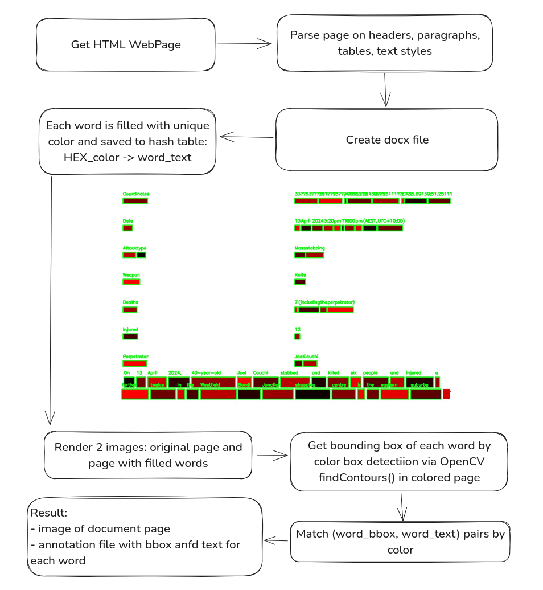
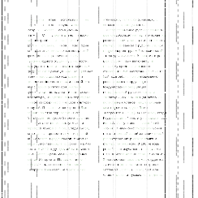
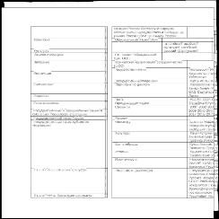
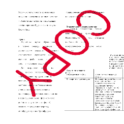

# DoGe — Synthetic DOcument GEnerator for Document AI

DoGe is designed to synthesize a dataset of realistic document scans. Each document contains meaningful text, headings, 
tables, pargraphs with different formatting and fonts which is parsed from Wiki and a bit randomized. The coordinates 
of the words are extracted using the No-OCR method we invented for faster generation on CPU. 


## Usage

```bash
git clone https://github.com/Travvy88/DoGe
cd DoGe
python main.py --out_dir data --remove_excisting_dir True --image_size 244 --max_urls 16 --num_processes 2 --ports 4000,4001,4002,4003
```

## How it works

### Generation Process


DoGe get HTML page of Wikipedia. Headers, paragrpahs formatting, tables are extracted and placed into Docx document. Each word is placed 
in separate Run tag inside Docx.
On that stage some random parametrization is applied. For example, font size, text alignment, one or two columns and some more parameters 
are chosen for each document randomly. 

Then each Run (equal of each word) is filled with unique color. As a result, a colored rectangle
appears in place of each word. Image will be encoded with 24 bit color depth, 
so maximal number of words per document are 16,777,216. Word is saved to color_code -> word hashmap. 
All rectangles coordinates are detected via OpenCV on document images. The word of each bounding box is get from hashmap. 

### Service Structure 

- Manager
- DocumentGenerators DocxDocument


## Image examples (size 244)





